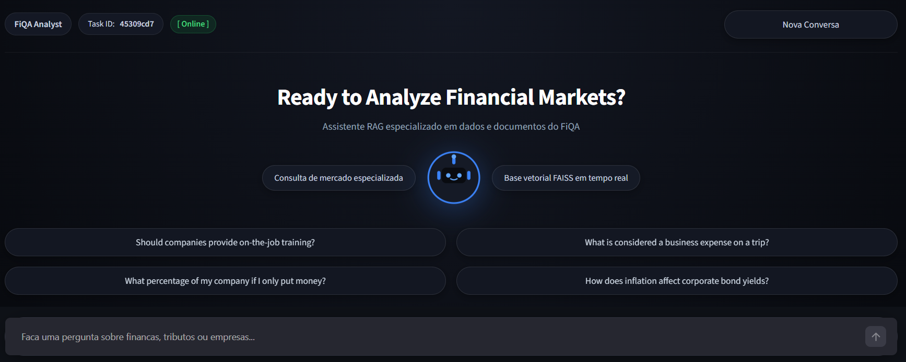

# FiQA RAG - Analista de Mercado Financeiro

Sistema de Recuperação Aumentada por Geração (RAG) especializado em finanças corporativas, investimentos e contabilidade, desenvolvido com FastAPI, LangGraph, FAISS, Groq (Llama-3) e Streamlit, com empacotamento completo em Docker.



---

## Integrantes da Equipe

* Vinícius de Almeida Silva
* Hallason Matias
* Arthur Azevedo
* Dayvson da Conceição

---

## Como Executar o Projeto (Guia Rápido)

### 1. Configuração de Variáveis

Crie o arquivo `.env` na raiz a partir do modelo e configure sua chave da Groq:

```bash
cp .env.example .env

# Defina GROQ_API_KEY=gsk_... dentro do .env
```

### 2. Execução via Docker Compose

```bash
docker compose up --build -d

docker compose logs -f fiqa-rag-api
```

---

## Matriz de Conformidade com os Requisitos da Atividade

| Requisito Solicitado                  | Implementação no Projeto                                                                                                      | Status   |
| :------------------------------------ | :---------------------------------------------------------------------------------------------------------------------------- | :------- |
| **Trabalho em Equipe e Entrega**      | Repositório estruturado para submissão da atividade.                                                                          | Conforme |
| **Motor do Chatbot**                  | Utilização da API da Groq com o modelo Llama-3 (sem uso de ChatGPT nativo).                                                   | Conforme |
| **Memória Gerenciada pelo Backend**   | Módulo `TaskMemoryService` centralizado no backend, controlando histórico e turnos sem delegar persistência ao modelo.        | Conforme |
| **Isolamento de Contextos por Tasks** | Cada interação está associada a um `task_id`. Usuários com identificadores distintos não compartilham contexto de conversa.   | Conforme |
| **Base de Dados Especializada**       | Uso do dataset `FiQA (Financial Opinion QA)` do benchmark BeIR, armazenado localmente para o pipeline de RAG.                 | Conforme |
| **Tecnologias do Backend**            | Python 3.11, FastAPI, orquestração via LangGraph e indexação vetorial com FAISS CPU.                                          | Conforme |
| **Frontend Livre e Amigável**         | Interface web modularizada construída em Streamlit com suporte à seleção de perguntas, exibição de fontes e gestão de sessão. | Conforme |
| **Execução e Reprodutibilidade**      | `docker-compose.yml` completo orquestrando backend e frontend em contêineres isolados.                                        | Conforme |
| **Documentação e Dependências**       | `README.md` explicativo, ficheiros de configuração (`requirements.txt`, Dockerfiles) e modelo de variáveis (`.env.example`).  | Conforme |

---

## Arquitetura e Engenharia do Projeto

O sistema opera sob uma arquitetura desacoplada em duas camadas principais (API e UI), orquestradas via rede interna do Docker.

### 1. Ingestão e Indexação Vetorial (FAISS)

* **Fonte de Dados:** Coleta dos documentos e passagens do dataset financeiro FiQA.

* **Divisão de Texto (Chunking):** O processador divide os textos em blocos semânticos delimitados para assegurar alta precisão de busca.

* **Geração de Embeddings:** O modelo `SentenceTransformer` mapeia o significado financeiro de cada fragmento em vetores densos.

* **Armazenamento:** O FAISS (Facebook AI Similarity Search) indexa e recupera por similaridade de cosseno/L2 os fragmentos mais relevantes com baixa latência.

### 2. Gerenciamento de Memória por Tasks no Backend

* **Regra de Isolamento:** O estado de conversação não é mantido no navegador e nem depende da inferência da IA para existir.

* **TaskMemoryService:** Singleton em memória no backend que armazena as interações anteriores organizadas pela chave `task_id`.

* **Injeção de Contexto:** Ao receber uma nova pergunta com um determinado `task_id`, o backend recupera os últimos turnos associados a essa tarefa e concatena o histórico ao contexto dos documentos antes da chamada ao modelo.

### 3. Orquestração do Agente com LangGraph

O fluxo cognitivo é estruturado como uma máquina de estados direcionada (`StateGraph`), composta pelas seguintes etapas:

* **retrieve_knowledge_node:** Consulta o índice FAISS e retorna os fragmentos com maior pontuação semântica.

* **evaluate_evidence_routing:** Avalia o limiar de confiança (`evidence_threshold_score`). Se o score for insuficiente, o agente desvia para abstenção em vez de alucinar.

* **build_context_node:** Estrutura os chunks documentais e adiciona o histórico prévio da `task_id`.

* **generate_answer_node:** Submete o prompt sintetizado ao Llama-3 via Groq.

* **handle_abstention_node:** Retorna resposta padrão de ausência de informação caso a base não contenha subsídios suficientes.

### 4. Interface Web Modularizada (Streamlit)

* **config.py:** Centralização de constantes, rotas base e configurações da aplicação.

* **api_client.py:** Isolamento das chamadas HTTP e comunicação direta com a API FastAPI.

* **styles.py:** Definições de CSS escuro responsivo e gráficos vetoriais do assistente.

* **components.py:** Renderização desacoplada da barra superior, hero, chips de consulta e fontes.

* **app.py:** Orquestração do ciclo de vida da sessão, mensagens e estado do utilizador.

---

## Estrutura de Diretórios

```text
.
├── docker-compose.yml
├── .env.example
├── .gitignore
├── README.md
├── fiqa-rag-api/
│   ├── Dockerfile
│   ├── requirements.txt
│   ├── config/
│   ├── data/
│   └── src/
│       ├── main.py
│       ├── controllers/
│       │   └── financial_analyst_controller.py
│       ├── services/
│       │   ├── agent_workflow_builder.py
│       │   ├── market_expert_service.py
│       │   └── task_memory_service.py
│       ├── models/
│       │   ├── analysis_request.py
│       │   ├── financial_analyst_state.py
│       │   └── application_settings.py
│       ├── repositories/
│       │   ├── market_knowledge_repository.py
│       │   ├── language_model_repository.py
│       │   └── source_dataset_repository.py
│       └── processors/
│           ├── database_seeder_processor.py
│           ├── text_splitter_processor.py
│           └── logger_mix_in.py
└── fiqa-rag-ui/
    ├── Dockerfile
    ├── requirements.txt
    ├── app.py
    ├── api_client.py
    ├── components.py
    ├── config.py
    └── styles.py
```
